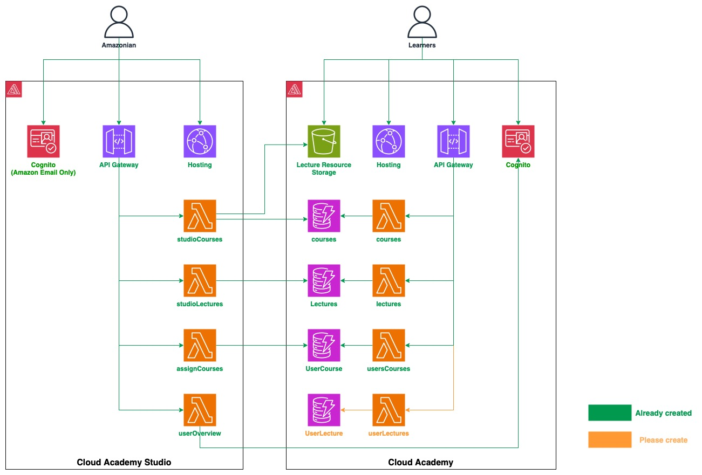

# HD BANK LEARNING MANAGEMENT SYSTEM

## Table of Contents
- [HD BANK LEARNING MANAGEMENT SYSTEM](#hd-bank-learning-management-system)
  - [Table of Contents](#table-of-contents)
  - [1. Architect Overview](#1-architect-overview)
  - [2. Clone Code:](#2-clone-code)
  - [3. Download Amplify CLI](#3-download-amplify-cli)
  - [4. Init Amplify and Connect Your Local Environment to the Cloud](#4-init-amplify-and-connect-your-local-environment-to-the-cloud)
    - [Step 1: Initialize Amplify for lms](#step-1-initialize-amplify-for-lms)
    - [Step 2: Initialize Amplify for lms-studio](#step-2-initialize-amplify-for-lms-studio)
    - [Step 3 S3 Access Policy for Lecture Resources](#step-3-s3-access-policy-for-lecture-resources)
    - [Policy Statements](#policy-statements)
    - [Usage](#usage)
    - [Notes](#notes)
  - [5. Check if Your Apps are Active](#5-check-if-your-apps-are-active)
  - [6. Run Frontend from Your Local Laptop](#6-run-frontend-from-your-local-laptop)
    - [6.1. How to Run LMS FE:](#61-how-to-run-lms-fe)
    - [6.2. How to Run LMS-Studio FE:](#62-how-to-run-lms-studio-fe)
  - [7. Add Sample Data to DynamoDB Tables](#7-add-sample-data-to-dynamodb-tables)
  - [8. How to Contribute to the Source Code?](#8-how-to-contribute-to-the-source-code)
  - [9. Publishing the Application](#9-publishing-the-application)
  - [10. Demonstrations](#10-demonstrations)
  - [11. Additional Step After Publishing](#11-additional-step-after-publishing)
  - [12. After Logging In and Creating an Account:](#12-after-logging-in-and-creating-an-account)
  - [13.Deploying Your Application with Amplify](#13deploying-your-application-with-amplify)
    - [Getting Started](#getting-started)
    - [Deploy Your App](#deploy-your-app)

---

## 1. Architect Overview

- Cloud Academy -> ***lms***
- Cloud Academy -> ***lms-studio***

## 2. Clone Code:

```
git clone https://git-codecommit.ap-southeast-1.amazonaws.com/v1/repos/lms-HDBank
```

---

## 3. Download Amplify CLI

To install and configure the Amplify CLI, please follow the instructions provided in the sections "Install the Amplify CLI" and "Configure the Amplify CLI" accessible through the following link: [Amplify Setup Instructions](https://docs.amplify.aws/cli/start/install/#configure-the-amplify-cli).

**Note:** During the configuration process, you will be prompted to sign into the AWS Console. It is essential that you log into your personal isengard account for AWS Console access.

**Step:** When prompted to "Specify the **AWS Region**," ensure that you select the **Singapore Region** as your operational region.

---

---
## 4. Init Amplify and Connect Your Local Environment to the Cloud

Follow these steps to configure Amplify for your project and sync your local environment with AWS CloudFormation.

### Step 1: Initialize Amplify for lms

1. Open your local `lms-HDBank` root folder.
2. Navigate to the `lms` directory:
   ```bash
   cd lms-HDBank/lms
   ```
3. Run the following command to initialize Amplify. If prompted, run the command with `sudo`:
   ```bash
   sudo amplify init
   ```
4. During the Amplify setup, provide the following details:
   - **Environment name**: Enter `hdbank`.
   - **Default editor**: Choose your preferred code editor from the list.
   - **Authentication method**: Select `AWS profile`.
   - **AWS profile**: Choose the profile you configured earlier (Refer to section 2 on configuring the Amplify CLI).

5. Push your local changes to the AWS cloud:
   ```bash
   amplify push
   ```

### Step 2: Initialize Amplify for lms-studio

1. In your local `lms-HDBank` root folder, navigate to the `lms-studio` directory:
   ```bash
   cd lms-HDBank/lms-studio
   ```
2. Initialize Amplify for the `lms-studio` project:
   ```bash
   sudo amplify init
   ```
3. If Amplify prompts you to import tables during the initialization, select tables like `courses-dev` and `lecture-resource`.
4. **Note**: Ensure that the S3 bucket name is formatted as follows: `lecture-resource...-[environment name]`.
5. Push the configurations to the cloud:
   ```bash
   amplify push
   ```
---

---
### Step 3 S3 Access Policy for Lecture Resources 

JSON policy document establishes permissions for users to interact with objects within an S3 bucket. The policy includes multiple statements, each tailored to handle specific types of actions like retrieving, uploading, and deleting objects under certain conditions.


### Policy Statements

1. **General Access Permissions**:
    - **Actions**: `s3:GetObject`, `s3:PutObject`, `s3:DeleteObject`
    - **Resources**: 
        - Public resources: `arn:aws:s3:::{s3-bucket-name}/public/*`
        - Protected resources: `arn:aws:s3:::{s3-bucket-name}/protected/${cognito-identity.amazonaws.com:sub}/*`
        - Private resources: `arn:aws:s3:::{s3-bucket-name}/private/${cognito-identity.amazonaws.com:sub}/*`
    - **Effect**: Allows the listed actions on public, protected, and private resources based on the user’s Cognito identity.

2. **Upload Permissions**:
    - **Action**: `s3:PutObject`
    - **Resource**: `arn:aws:s3:::{s3-bucket-name}/uploads/*`
    - **Effect**: Allows users to upload files to a specified 'uploads' directory within the S3 bucket.

3. **Read-Only Access to Protected Resources**:
    - **Action**: `s3:GetObject`
    - **Resource**: `arn:aws:s3:::{s3-bucket-name}/protected/*`
    - **Effect**: Grants read-only access to all users for protected resources.

4. **Bucket Listing Permissions**:
    - **Condition**: Restricts listing to specific prefixes which correspond to the access levels (public, protected, private linked to user’s Cognito sub).
    - **Action**: `s3:ListBucket`
    - **Resource**: `arn:aws:s3:::{s3-bucket-name}`
    - **Effect**: Allows users to list the contents of the bucket but only for the paths they are authorized to view.

### Usage

- **Public Access**: Any user can access resources under the 'public' directory.
- **Protected Access**: Users can access resources in the 'protected' directory that are specifically linked to their Cognito identity.
- **Private Access**: Similar to protected, but for highly sensitive resources.
- **Uploads**: Users can add content to the 'uploads' directory which can be moderated or moved to appropriate directories by administrators.

Replace `{s3-bucket-name}` with the actual name of your S3 bucket and ensure that Cognito identities are correctly configured to use this policy effectively.

### Notes

- Ensure that your AWS S3 bucket and Cognito services are properly set up and that the bucket name in the policy is replaced with your actual bucket name.
- Modify the policy as necessary to align with your specific security requirements and user access levels.

- We will create a policy to provide access to the S3 lecture resources with the following content:

```
{
    "Version": "2012-10-17",
    "Statement": [
        {
            "Action": [
                "s3:GetObject",
                "s3:PutObject",
                "s3:DeleteObject"
            ],
            "Resource": [
                "arn:aws:s3:::{s3-bucket-name}/public/*",
                "arn:aws:s3:::{s3-bucket-name}/protected/${cognito-identity.amazonaws.com:sub}/*",
                "arn:aws:s3:::{s3-bucket-name}/private/${cognito-identity.amazonaws.com:sub}/*"
            ],
            "Effect": "Allow"
        },
        {
            "Action": [
                "s3:PutObject"
            ],
            "Resource": [
                "arn:aws:s3:::{s3-bucket-name}/uploads/*"
            ],
            "Effect": "Allow"
        },
        {
            "Action": [
                "s3:GetObject"
            ],
            "Resource": [
                "arn:aws:s3:::{s3-bucket-name}/protected/*"
            ],
            "Effect": "Allow"
        },
        {
            "Condition": {
                "StringLike": {
                    "s3:prefix": [
                        "public/",
                        "public/*",
                        "protected/",
                        "protected/*",
                        "private/${cognito-identity.amazonaws.com:sub}/",
                        "private/${cognito-identity.amazonaws.com:sub}/*"
                    ]
                }
            },
            "Action": [
                "s3:ListBucket"
            ],
            "Resource": [
                "arn:aws:s3:::{s3-bucket-name}"
            ],
            "Effect": "Allow"
        }
    ]
}

```
- After successfully creating the S3 access policy, we then attach it to a role. Search for the role named **amplify-lmsstudio-hdbank-id-authRole** and attach the newly created policy to it.

---

---
## 5. Check if Your Apps are Active

Follow these steps to verify whether your applications, `lms` and `lmsstudio`, are currently active:

- **Step 1:** Log in to your account on the platform.
- **Step 2:** Navigate to the **Amplify** service.
- **Step 3:** Once in the Amplify service, locate your applications in the dashboard. The status next to the app names (`lms` and `lmsstudio`) will indicate whether they are active or not.

Ensure you are viewing the correct region and project to see the status of your applications. If your apps are not listed, double-check the project settings or contact support.

---

---

## 6. Run Frontend from Your Local Laptop

This section outlines the steps to run the frontend components of the Learning Management System (LMS) on your local machine. Please follow the instructions for each application.

### 6.1. How to Run LMS FE:
To run the LMS Frontend (FE), follow these steps:
1. **Open your Command Line Interface**: Access the command line or terminal on your local machine.
2. **Navigate to the LMS Root Directory**: Use the `cd` command to change to the LMS directory.
   ```bash
   cd LMS/lms/
   ```
3. **Install Dependencies**: Run the following command to install necessary dependencies via npm (Node Package Manager).
   ```bash
   npm i
   ```
4. **Start the Application**: Start the server using npm.
   ```bash
   npm start
   ```
   This will launch the LMS FE on your local machine. Once the server starts, you can access the application via a web browser.

### 6.2. How to Run LMS-Studio FE:
To run the LMS-Studio Frontend (FE), the steps are similar to those for LMS FE:
1. **Open your Command Line Interface**: Ensure that your terminal or command prompt is open.
2. **Navigate to the LMS-Studio Directory**: Change to the LMS-Studio directory.
   ```bash
   cd LMS/lms-studio/
   ```
3. **Install Dependencies**: Use npm to install the necessary dependencies.
   ```bash
   npm i
   ```
4. **Start the Application**: Initiate the server to start running the application.
   ```bash
   npm start
   ```
   Once executed, the LMS-Studio FE will be running on your local machine, and can be accessed through a web browser.

---

---
## 7. Add Sample Data to DynamoDB Tables

To populate the DynamoDB tables with sample data:

- Navigate to the `sample-data` folder where you'll find pre-prepared JSON files for both the Course and Lecture tables.
- Use the JSON view in the DynamoDB Console to add these data items to your tables.

## 8. How to Contribute to the Source Code?

If you're interested in contributing to the project, follow these steps:

1. **Clone the Repository**
   - Begin by cloning the repository as described in section 1. Ensure you are on the master branch.

2. **Create a Feature Branch:**
   - From the master branch, create a new feature branch. Follow the naming convention `f_feature_name` (e.g., `f_create_course`).

3. **Develop and Test:**
   - Develop and test your features within this branch.

- **Implement the User Interface:**
  - Use React JS to build the user interface.

- **API Integration:**
  - Integrate the user interface with the backend using existing APIs.
  - The API Gateway and DynamoDB tables have been pre-configured. A lambda function named `studioCourses` for `/courses/` APIs is also available.

- **Manage Resources:**
  - To import a DynamoDB table or S3 bucket from LMS to the LMS Studio project, execute `amplify import storage`.
  - If there's a need to add new APIs and lambda functions, use `amplify update api` and include the new path.
  - Name Lambda functions with a `studio` prefix (e.g., `studioCourses`, `studioLectures`) to prevent conflicts with the LMS project.

- **Consistency:**
  - Develop Lambda functions using Node.js to maintain consistency with the existing codebase.
  - Avoid creating new API gateways.

---


---

## 9. Publishing the Application

To deploy your application, follow the steps below for each part of the application. Make sure you are in the correct directory before running each command.

```bash
# Navigate to the 'lms' directory and publish it
cd lms
amplify publish

# Navigate to the 'lms-studio' directory and publish it
cd lms-studio
amplify publish
```

This will execute the `amplify publish` command in both the `lms` and `lms-studio` directories. This command prepares and deploys your application to the AWS cloud, making it accessible via the web.

## 10. Demonstrations

Here are demonstrations of the application components deployed:

- **AWS Cloud Academy Studio**: A detailed demo can be viewed at [AWS Cloud Academy Studio](#). This demonstration showcases the functionality and features of the Studio component of the application.

- **Cloud Solution Journey**: For a walkthrough of the Cloud Solution Journey, visit [Cloud Solution Journey](#). This demo provides insights into the cloud solutions provided by the application.

---


---

## 11. Additional Step After Publishing
Once you have published, please proceed with the following steps to configure user attributes in AWS Cognito:

1. Navigate to your **AWS Cognito User Pool**.
2. Click on the **"Sign-up experience"** tab.
3. Locate the **"Custom attributes"** section and select **"Add custom attributes."**
4. For users signing up in the **lms** cognito user pool, add a custom attribute with the key **"name_on_certificate."**
5. For users signing up in the **lms-studio** cognito user pool, add a custom attribute with the key **"role."**

These attributes will allow for a more tailored user experience and better management of user roles and permissions within the system.

---

---

## 12. After Logging In and Creating an Account:

- If you wish to become a Studio Administrator, navigate to Amazon Cognito.
- Select **User Pools**.
- Choose the `lmsstudio-id_userpool_id-hdbank`.
- Click on **Users**.
- Find and select your user account.
- Click on **User Attributes**, then select **Edit**.
- For the attribute `custom:role`, change its value to `admin`.
- Click **Save Changes** to apply the new settings.

---

---

## 13.Deploying Your Application with Amplify

This guide walks you through the steps to deploy your application using a Git provider through the Amplify interface.

### Getting Started

1. **Create a New App**
    - Navigate to the Amplify interface.
    - Click on **Create new app**.

### Deploy Your App

Follow these steps to deploy your app from a Git provider:

1. **Select Git Provider**
    - Choose **Code Commit**.
    - Click **Next**.

2. **Add Repository and Branch**
    - Select your repository.
    - Choose the appropriate branch.
    - Check the box for **My app is a monorepo**.
    - In the field **Monorepo root directory**, enter `lms` or `lms-studio`.
    - Click **Next**.

3. **Select a Backend Environment**
    - Choose the app name.
    - Select the environment name.
    - For the service role, select `amplifyconsole-backend-role` or create a new role with the **AdministratorAccess-Amplify** policy.
    - Click **Next**.

4. **Save and Deploy**
    - Click **Save and deploy** to initiate the deployment of your application.

--- 
